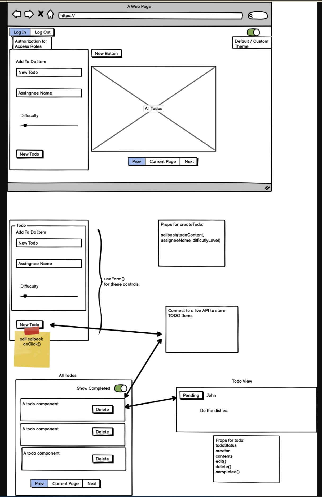

# todo-app

## Lab class 31

### Lab problem
In Phase 1, we’re going to perform some refactoring of the To Do application as built by another team. This application mixes application state and user settings at the top level and passes things around. It was a good proof of concept, but we need to make this production ready.

Style the application using the Blueprint Component API{target:_blank}

Properly modularize the application into separate components

Implement the Context API to make some basic application settings available to components

How many To Do Items to show at once
Whether or not to show completed items

## Lab class 31

### Lab problem
Extend your context provider to include all of the following features:
Create a context for managing application settings and provide this at the application level.
Display or Hide completed items (boolean).
Number of items to display per screen (number).
Default sort field (string).
Create a function in your context that saves user preferences (for the above) to local storage.
Implement a useEffect() (or componentDidMount()) in your context to read from local storage and set the values for those 2 state properties on application load.
Note: You will need to stringify your state prior to saving to local storage, and parse it when you retrieve it.

Consume and utilize Context values throughout your components:
Show a maximum of a certain number of items per screen in the <List /> component.
Provide “next” and “previous” links to let the users navigate a long list of items.
Hide or show completed items in the list.
Optional: Sort the items based on any of the keys (i.e. difficulty).

## UML

## Deployed site
https://todo-list-template.netlify.app/

## Tests
To run test, type "npm Lab-32"

### Contributions
Jeffrey Smith, Jordan Yamada, TA's